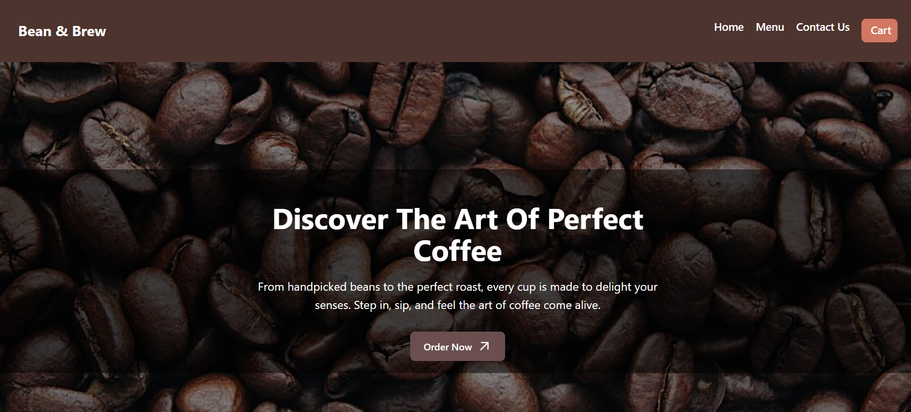
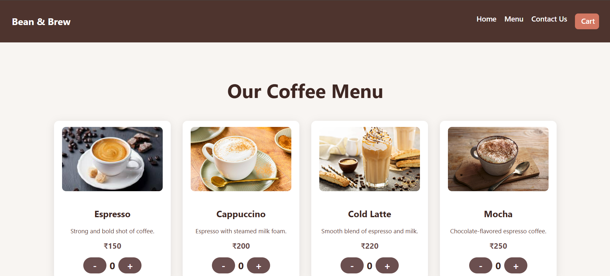
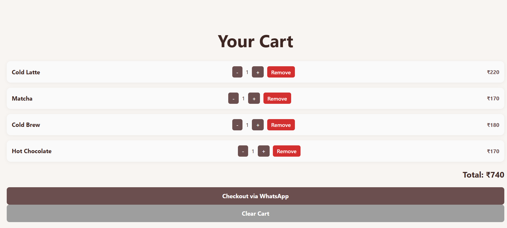

# ☕ Bean & Brew - Cafe Website

A modern and responsive cafe website built with **React + Vite**.  
Includes a dynamic menu, cart system, and mobile-friendly navigation.

---

## ✨ Features
- 📱 Responsive design for mobile & desktop  
- 🛒 Cart functionality with item count  
- 📋 Menu page with product listing  
- ⚡ Fast performance with Vite + React Router  

---

## 🛠️ Tech Stack
- **React 19**  
- **React Router DOM**  
- **Vite**  
- **CSS3**  

---

## 🌍 Live Demo
👉 [Bean & Brew Website](https://abhavya28.github.io/Cafe-Website)

---

## 📸 Screenshots
### 🏠 Home Page

### 📋 Menu Page

### 🛒 Cart Page

---

## 👩‍💻 Author
**Abhavya Gupta**  
B.Tech CSE | Frontend Developer  

🔗 [GitHub Profile](https://github.com/Abhavya28)  

---
